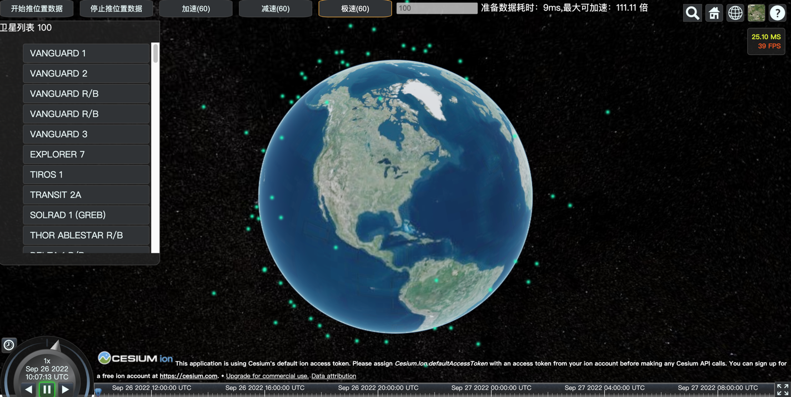
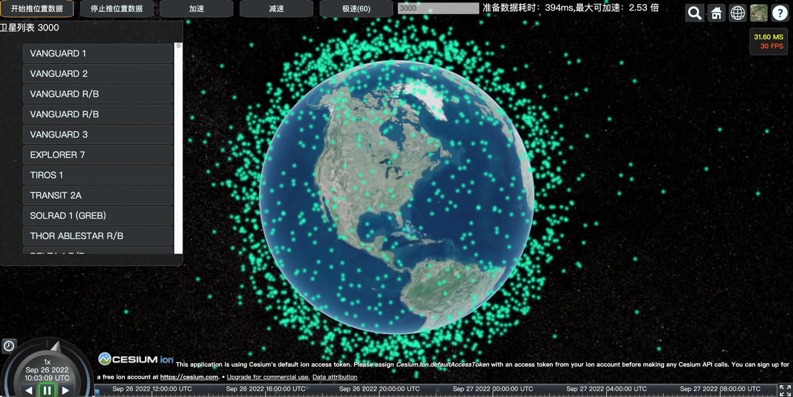
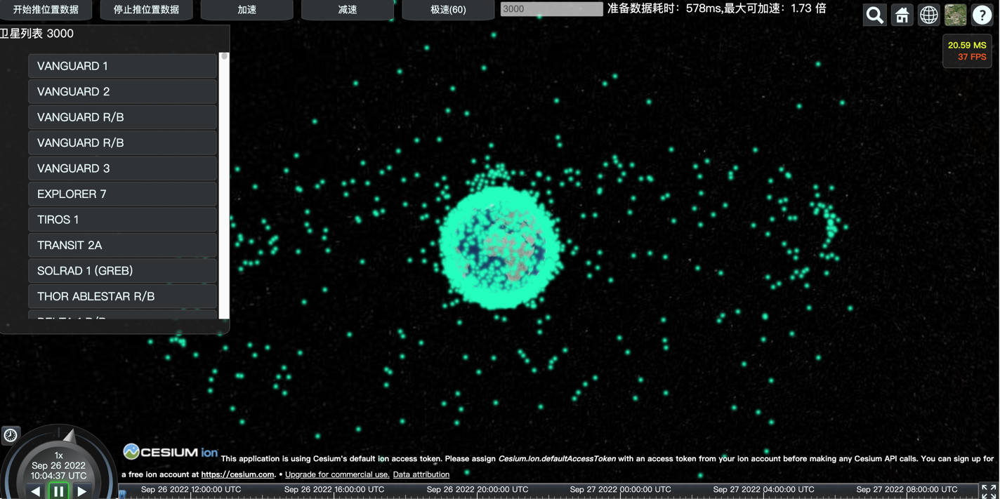

# Websocket-czml

image:https://img.shields.io/badge/vert.x-4.3.3-purple.svg[link="https://vertx.io"]

运行要求：
windows_x86_64、jdk11及以上

在 windows-10-x86_64 和jdk11.0.14上测试通过

启动脚本
```shell
java -Dfile.encoding=utf-8 -jar ./target/websocket-czml-1.0.0-windows-x86_64.jar
```
浏览器访问地址
ip地址+8081端口
举例：http://localhost:8081

img1

img2

img3

